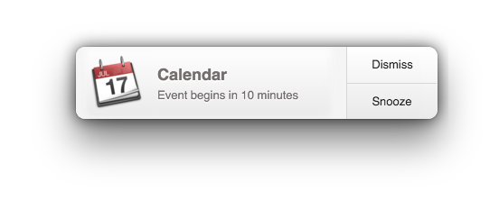

## Electron Notifications

A node module for sending notifications in electron applications.

## Quick Usage

~~~ javascript
const notifier = require('electron-notifications')

// Just title
notifier.notify('Calendar')

// Full Options
notifier.notify('Calendar', {
  message: 'Event begins in 10 minutes',
  icon: 'http://cl.ly/J49B/3951818241085781941.png',
  buttons: ['Dismiss', 'Snooze'],
})
~~~

## Installation

~~~
npm install --save electron-notifications
~~~

## Playbook

If you'd like to see this in action you can run the playbook and try out live
examples and edit the code in place.

~~~
git clone git@github.com:blainesch/electron-notifications.git
npm run playbook
~~~

## Introduction

When you create a new notification, your notification is queued, since we only
display one at a time. Each notification is a [BrowserWindow](browserwindow)
instance, so it's completely cross platform.

## Options

All options are optional.

* `message`: A message to display under the title.
* `icon`: The absolute URL of a icon displayed to the left of the text.
* `buttons`: One or two buttons to display on the right of the notification.
* `vertical`: Boolean (default: false) that specifies that the buttons should be stacked vertically.
* `duration`: Integer duration in milliseconds (default: 4000) to show the notification.
* `flat`: Boolean (default: false) that specifies to use a flat button style notification.

## Events

In addition to the [events provided by electron](events) you also have access to
the following 3 additional events.

### Clicked

When the notification was clicked, but not dragged. This usually does the
default action, or closes the notification.

~~~ javascript
const notification = notifier.notify('Calendar')

notification.on('clicked', () => {
  notification.close()
})
~~~

### Swiped Right

When the notification has been swiped to the right. This usually indicates that
the user wants to dismiss the notification.

~~~ javascript
const notification = notifier.notify('Calendar')

notification.on('swipedRight', () => {
  notification.close()
})
~~~

### Button Clicked

When any one of the buttons are clicked, it'll trigger a `buttonClicked` event,
and pass the text that was clicked to the handler.

~~~ javascript
const notification = notifier.notify('Calendar', {
  buttons: ['Dismiss', 'Snooze'],
})

notification.on('buttonClicked', (text) => {
  if (text === 'Snooze') {
    // Snooze!
  }
  notification.close()
})
~~~

[events]: https://github.com/electron/electron/blob/master/docs/api/browser-window.md#events
[browserwindow]: https://github.com/electron/electron/blob/master/docs/api/browser-window.md
